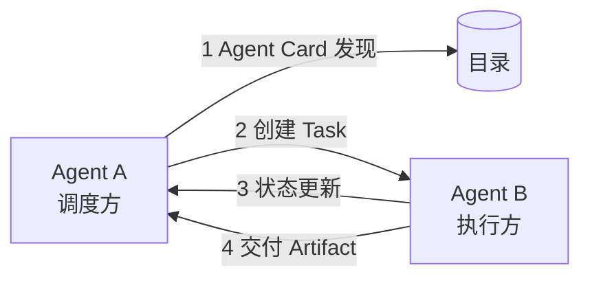

# A2A：让 Agent 与 Agent 对话

> 「AI Agent 工程实践」系列 · 进阶篇第 5 篇。
> 智能体间通信协议。
> 相关：[MCP](./mcp.md) / [意图路由](./intent-routing.md)

## 什么是 A2A

A2A（Agent2Agent）协议由 Google 于 2025 年 4 月开源。

目标：让**不同厂商、不同框架**的 Agent 能互相发现、通信、协作、传递任务。

与 MCP 的分工一句话：**MCP 是"Agent 用工具"，A2A 是"Agent 找 Agent"**。

## 核心概念

| 概念 | 说明 |
| --- | --- |
| **Agent Card** | Agent 的"名片"：能力、技能、端点，供被发现 |
| **Task** | 任务单元：描述 + 状态（submitted / working / completed / failed）+ 结果 |
| **Message** | 消息：Agent 间的通信载体（内容、角色、上下文） |
| **Skill** | Agent 声明的可调用技能清单，与 Agent Card 关联 |
| **Artifact** | 任务产物：文件、数据，可被传递 |

## 工作流（概念）

1. **发现**：通过 Agent Card 目录 / 注册表找到目标 Agent；
2. **协商**：确认对方的技能、输入输出格式；
3. **委托**：创建 Task 发给对方；
4. **协作**：交换 Message、跟踪 Task 状态；
5. **交付**：取回 Artifact。

## 什么时候需要 A2A

| 场景 | 例子 |
| --- | --- |
| 跨厂商 / 跨系统 | 你的 Agent 要调用"别人家"的 Agent |
| 企业内部多系统 | 每个系统各有一个 Agent，需要互相协作 |
| 任务分派 | 总控 Agent 把子任务分给多个专业 Agent |

## 与 MCP 的分工

| | MCP | A2A |
| --- | --- | --- |
| 连接 | Agent ↔ 工具 / 数据 | Agent ↔ Agent |
| 解决 | 怎么用工具 | 怎么协作 |
| 类比 | USB-C（插设备） | 电话 / 书信（人与人） |

## 注意（坑）

1. **A2A 是协作协议，不是调度框架**：任务怎么拆、谁负责、失败怎么办，还是你自己的逻辑；
2. **安全**：跨 Agent 通信要鉴权——对方可能是恶意 Agent，别把敏感数据随便发出去；
3. **状态管理**：Task 状态要持久化，执行方挂了要能恢复；
4. **标准仍在演进**：接入前看最新文档，别照抄旧示例。

## 总结

A2A 让 Agent 从"单兵"变"联网"。做跨系统协作时先想清楚：接工具用 MCP，接 Agent 用 A2A。最后一篇讲 Agent 能力组织的"技能包"——[SKILL 技能系统](./skill.md)。
