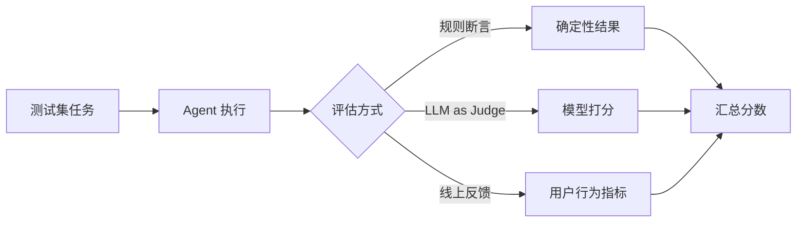

# Agent 评估：怎么量化"这个 Agent 好不好"

> 「AI Agent 工程实践」系列 · 生产篇第 3 篇，质量度量。
> 相关：[反思与自我修正](./agent-reflection.md) / [Agent 可观测性](./agent-observability.md)

## 为什么评估很难

普通模型可以用"答案对不对"来评，Agent 麻烦得多：

- 任务没有唯一正确答案（"帮我调研一下"怎么算对？）；
- 过程比结果重要（调用了 3 次工具 vs 30 次，都是"完成"）；
- 部分成功（前面全对，最后一步错了）；
- 轨迹长，人工看不过来。

所以要拆成**多个维度**分别量化。

## 评估什么：四个核心维度

| 维度 | 问什么 | 怎么量化 |
| --- | --- | --- |
| 任务成功率 | 最终结果对不对 | 与参考答案比对 / 规则判定 |
| 工具调用质量 | 有没有选错工具、传错参数 | 工具名、参数 schema 校验 |
| 轨迹质量 | 步骤多不多、有没有空转/死循环 | 步数、往返次数、重试率 |
| 成本与延迟 | 花了多少钱、多少时间 | token 数、耗时、调用次数 |

## 三种评估方法

### 1. 规则 / 断言评估（确定性）

结果能程序化校验的，用断言最快：

```js
function evaluate(result) {
  const checks = [
    result.finished === true,                       // 是否跑完
    result.toolCalls.every((t) => t.valid),         // 工具调用全部合法
    result.steps <= 10,                             // 步数不超限
    result.costUsd <= 0.1,                          // 成本可控
  ];
  const failed = checks.filter((c) => !c).length;
  return { pass: failed === 0, failedCount: failed, checks };
}
```

适合有明确验收标准的任务（代码测试通过、字段格式正确、金额对得上）。

### 2. LLM-as-Judge（让强模型打分）

开放任务没有标准答案时，让更强的模型按 rubric 打分：

```text
你是评估员。按以下标准给 Agent 的回答打分（1-5）：
1. 是否直接回答了用户问题
2. 事实是否可被验证，有没有编造
3. 是否给了可执行的下步建议

Agent 回答：...
```

### 3. 线上指标与用户反馈

开发环境的评估永远是近似，最终以线上为准：任务完成率、用户重试率、投诉率、退出率。



## 注意（坑）

1. **LLM-as-Judge 有偏置**：偏好长答案、偏好自己的风格、位置偏置（先看的答案更容易高分）——打分 prompt 要写清标准，必要时**双向对比**而非绝对打分；
2. **评估集会过拟合**：在测试集上分数刷高 ≠ 真实好用，测试集要定期换新任务、覆盖长尾场景；
3. **"完成"不等于"做对"**：Agent 可能礼貌地跑完全流程但结果全错——规则断言只查形式（finished）不够，要对**结果内容**断言；
4. **人工标注不可省**：规则和 LLM 打分都是近似，定期抽一批轨迹人工复核，校正评估器本身；
5. **先定指标再迭代**：没有评估就跑 prompt/结构迭代，等于闭眼调参。

## 总结

评估 = **维度拆解 + 方法组合**：能程序化判断的用规则，开放性的用 LLM-as-Judge，最终用线上数据兜底。先量化，再优化。

下一篇：[Agent 可观测性](./agent-observability.md)——线上出问题时，怎么看清 Agent 到底干了什么。
