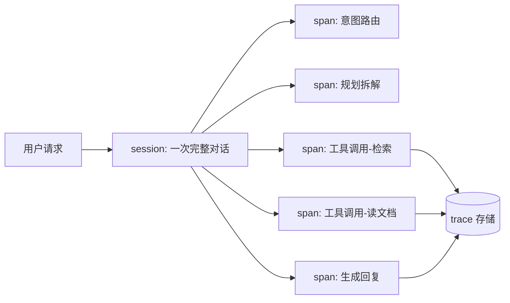

# Agent 可观测性：看清 Agent 每一步在干什么

> 「AI Agent 工程实践」系列 · 生产篇第 4 篇，线上排障。
> 相关：[Agent 评估](./agent-evaluation.md) / [工具安全与提示注入](./tool-safety.md)

## 为什么 Agent 更需要可观测性

传统接口是"请求 → 响应"，出问题看日志就行。Agent 不一样：

- 一次请求内部有**十几步**：规划、调工具、读结果、再规划、生成；
- 错误藏在**中间步骤**里（某个工具参数传错了）；
- 同样的任务，这次成功下次失败，**不确定性是常态**。

线上报"答错了"，没有 trace 根本没法排查。

## 记录什么：trace 三要素

一次 Agent 执行 = 一个 **session**，里面是**一棵 span 树**：



每个 span 至少记录：

| 字段 | 内容 |
| --- | --- |
| 名称 | 这一步在干什么（规划/工具/生成） |
| 输入 | prompt、工具参数 |
| 输出 | 工具结果、模型回答 |
| 元数据 | 模型名、token 数、耗时、重试次数、是否成功 |

## 代码示意：最简 tracer

给每个函数包一层"记录器"：

```js
function createTracer() {
  const spans = [];
  return {
    span(name, fn) {
      const start = Date.now();
      try {
        const output = fn();
        spans.push({ name, ok: true, ms: Date.now() - start, output });
        return output;
      } catch (e) {
        spans.push({ name, ok: false, ms: Date.now() - start, error: String(e) });
        throw e;
      }
    },
    dump() {
      return spans; // 落库/上报
    },
  };
}

// 使用
const tracer = createTracer();
const result = tracer.span('retrieve', () => search(query));
tracer.span('generate', () => llm(prompt));
```

真实系统用 OpenTelemetry 之类的标准 trace 协议，一个 session 一个 traceId，span 可嵌套、可跨服务关联。

## 除了 trace 还要什么

| 层级 | 记录什么 | 解决什么问题 |
| --- | --- | --- |
| Trace | 调用链、每步输入输出 | 单次排查"错在哪一步" |
| 日志 | 报错、警告、关键事件 | 定位异常 |
| 指标 | 成功率、延迟、token 消耗、重试率 | 趋势与容量规划 |
| Token 审计 | 每次调用的 token 数 | 成本归因、超限告警 |

## 注意（坑）

1. **敏感信息脱敏**：工具参数里可能有密码、身份证、token——落库前必须脱敏，否则 trace 存储本身就是泄露点；
2. **记录本身有成本**：每次调用都存完整 prompt 和输出，存储和查询开销不小，可以只存关键 span、大内容存对象存储；
3. **traceId 要贯穿**：Agent 内部调外部服务（LLM、搜索、内部 API），需要把 traceId 一路透传下去，否则跨服务断链；
4. **重试要可视**：Agent 内部重试多少次、每次为什么失败，是判断"模型抽风还是系统故障"的关键证据；
5. **没有 trace 的 Agent 不要上线**：出一次事故却无法复盘，比事故本身更糟。

## 总结

可观测性 = **trace（看清过程）+ 日志（定位异常）+ 指标（量化趋势）+ 脱敏（守住底线）**。生产 Agent 的排障，本质是"回放一次执行"。

下一篇：[工具安全与提示注入](./tool-safety.md)——看清了运行，最后一道坎：别让 Agent 被坏内容忽悠着干坏事。
