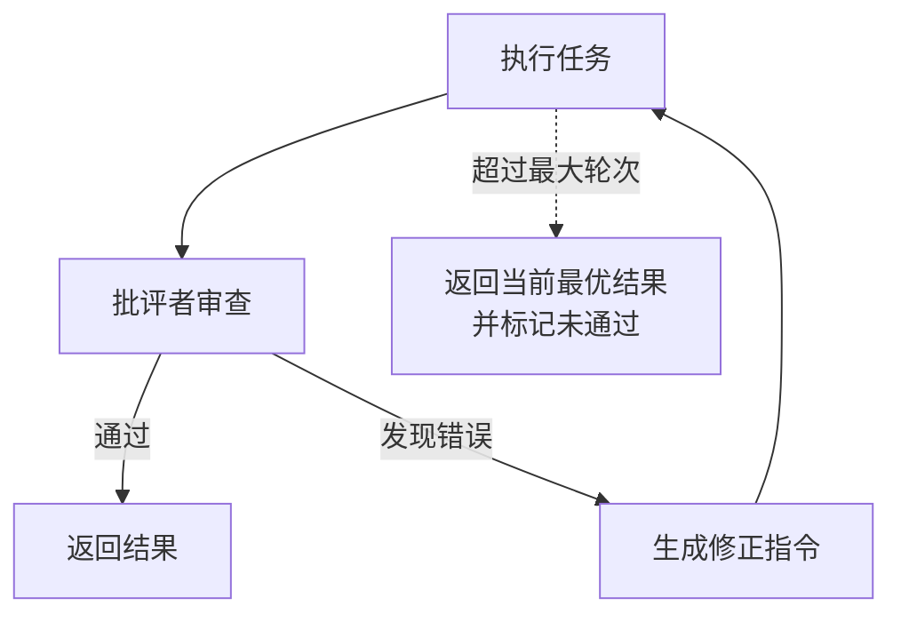

# 反思与自我修正：Agent 出错了怎么办

> 「AI Agent 工程实践」系列 · 生产篇第 2 篇，自我改进循环。
> 相关：[多 Agent 编排](./multi-agent.md) / [推理范式](./reasoning-paradigms.md) / [Agent 评估](./agent-evaluation.md)

## 什么是反思

LLM 一次性生成的结果经常有错。反思（Reflection）就是让 Agent **执行后自己检查一遍，发现问题、修正、再执行**，直到通过或达到上限。

一句话：**给 Agent 一个"审稿人"视角**。

## 第一版：执行 → 自评 → 重试

最简单的方式：执行任务，让模型评价自己的结果，不通过就把批评意见拼回任务里重试。

```js
async function runWithReflection(task, maxTurns = 3) {
  let current = task;

  for (let i = 0; i < maxTurns; i++) {
    const answer = await execute(current);

    const verdict = await judge(task, answer); // 返回 { pass, reason }
    if (verdict.pass) {
      return answer;
    }

    // 把批评拼进任务，强制下一轮修正
    current = `${task}\n【上一轮结果有误：${verdict.reason}，请修正后重做】`;
  }

  return execute(current); // 上限兜底
}
```

问题很明显：**"自己审自己"容易自卖自夸**——模型很难发现自己同样会犯的错。

## 第二版：批评者与执行者分离

让一个独立角色（或独立 prompt）专门当批评者，只负责挑毛病，不负责解题：

```js
const EXECUTOR = '你是解题者，给出答案。';
const CRITIC = '你是严格审稿人，只挑错不修改，指出事实错误、遗漏和逻辑漏洞。';

async function runWithCritic(task, maxTurns = 3) {
  let answer = '';
  for (let i = 0; i < maxTurns; i++) {
    answer = await llm(`${EXECUTOR}\n任务：${task}`);
    const critique = await llm(`${CRITIC}\n任务：${task}\n答案：${answer}`);
    if (critique === '无问题') return answer;
    task = `${task}\n【审稿意见】${critique}\n请据此修正答案。`;
  }
  return answer;
}
```

分离之后，批评者不背"解题压力"，更容易挑出执行者的错。

## 完整循环



## 对比：一次性 vs 自评 vs 分离批评

| 方式 | 准确率 | 成本 | 适用 |
| --- | --- | --- | --- |
| 一次性生成 | 最低 | 1 次调用 | 简单任务、实时聊天 |
| 自评重试 | 中 | 2-3 次调用 | 中等问题 |
| 独立批评者 | 较高 | 3-4 次调用 | 代码、写作、复杂推理 |

## 注意（坑）

1. **批评噪声**：审稿意见可能瞎改——不是每次批评都该听，可以**多批评者投票**或用规则过滤明显错误；
2. **成本翻倍**：反思一轮 = 执行 + 审查，两三轮就 4-6 次调用，**设上限**（maxTurns）是必须的；
3. **"通过"标准要具体**：让模型空泛地说"还行"等于没审，要给它 checklist（事实是否可验证、逻辑是否闭环、有没有遗漏）；
4. **错误反馈不能只靠 prompt 文字**：真实系统里把工具报错、测试失败、编译错误这些**硬信号**喂回去，比模型自评可靠得多；
5. **死循环**：有些任务无论怎么改都不过（任务本身无解），兜底返回当前最优 + 明确标记"未通过"。

## 总结

反思 = **执行 → 审查 → 修正**的循环。关键是审查者与执行者**角色分离**、审查标准**可执行**、轮次**有上限**。硬信号（报错/测试失败）比软评价（自评）更值得信任。

下一篇：[Agent 评估](./agent-evaluation.md)——怎么量化"这个 Agent 到底好不好"，不能只靠感觉。
