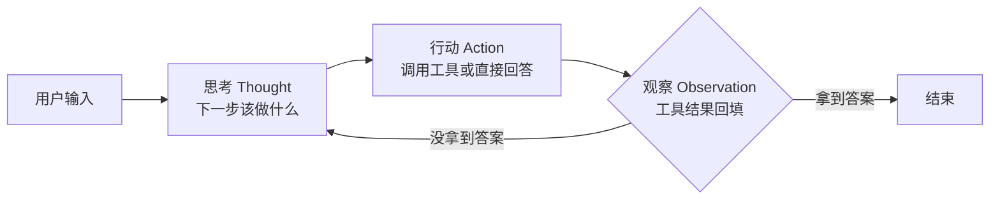

# 手写一个 Agent：从 ReAct 循环说起


> 「AI Agent 工程实践」系列第 1 篇，从零手写一个可用的 Agent。
> 配套全景：[AI Agent（智能体）学习资料](./ai-agent-learning.md)
> 系列后续：RAG / 提示词工程 / Function Calling / 意图路由 / HITL

## 什么是 Agent

一句话：Agent 接收的是**目标**而不是逐条指令，它能自主规划、调用工具、交付结果。

| 维度 | Chatbot | Copilot | Agent |
| --- | --- | --- | --- |
| 输入 | 指令 | 指令 + 半自动补全 | 目标 |
| 执行 | 回答即结束 | 人在回路辅助 | 自主拆解 → 调工具 → 交付 |
| 工具 | 基本无 | 少量 | 可调 API / 网页 / 代码 |
| 状态 | 无状态 | 会话内 | 有记忆，可多轮自我修正 |

本文不讨论概念，直接动手：用 JS 写一个最小的 Agent，并一步步把它变强。

## Agent 的最小循环：ReAct

ReAct（Reason + Act，2022 年 Yao 等提出）是目前绝大多数 Agent 的核心范式：**思考 → 行动 → 观察**，循环往复，直到拿到答案。



关键点：**模型不直接执行任何东西**，它只负责"想"和"选"，真正干活的是你的程序。

## 第一版：只会一次工具调用的 Agent

先准备一个工具注册表（tool registry）：

```js
const tools = {
  getWeather: {
    description: '查询指定城市的当前天气',
    fn: async (city) => `城市:${city} 晴 25℃`
  },
  getTime: {
    description: '获取当前时间',
    fn: async () => new Date().toLocaleString('zh-CN')
  }
};
```

工具描述里**必须写清楚"什么时候用"**，这是模型选择的唯一依据。

再构造 system prompt，告诉模型可用工具和输出格式：

```js
const systemPrompt = `
你是一个助手，可以调用以下工具：
${Object.entries(tools)
  .map(([name, t]) => `- ${name}: ${t.description}`)
  .join('\n')}

输出必须是严格 JSON（不要输出其他内容）：
- 需要工具时：{"action": "工具名", "input": {参数}}
- 已有答案时：{"action": "finish", "answer": "最终回答"}
`;
```

单次调用：

```js
async function callLLM(messages) {
  // 省略：调用任意大模型 API
  // return await fetch(api, { method: 'POST', body: JSON.stringify({ messages }) });
}

async function agentV1(userInput) {
  const messages = [
    { role: 'system', content: systemPrompt },
    { role: 'user', content: userInput }
  ];

  const reply = await callLLM(messages);
  const parsed = JSON.parse(reply);           // 假设模型乖乖输出了 JSON

  if (parsed.action === 'finish') return parsed.answer;

  const tool = tools[parsed.action];
  if (!tool) return `工具 ${parsed.action} 不存在`;

  return await tool.fn(parsed.input);         // 执行工具，拿结果
}

await agentV1('北京今天天气怎么样？');   // 城市:北京 晴 25℃
```

能跑，但它只会"一问一答一次工具调用"，离 Agent 还差得远——**模型不知道下一步该干嘛，也没法根据工具结果继续**。

## 第二版：循环起来，Agent 自己决定下一步

把"思考 → 行动 → 观察"串成循环：每轮把工具结果作为新的消息回填给模型，模型据此决定下一步。这才是 ReAct 的真身。

```js
async function agentV2(userInput, { maxIterations = 5 } = {}) {
  const messages = [
    { role: 'system', content: systemPrompt },
    { role: 'user', content: userInput }
  ];

  for (let i = 0; i < maxIterations; i++) {
    const reply = await callLLM(messages);
    const parsed = safeParse(reply);          // 容错解析，见下

    if (!parsed) {                            // 模型没输出合法 JSON
      messages.push({ role: 'user', content: '输出格式错误，请只输出合法 JSON。' });
      continue;
    }

    if (parsed.action === 'finish') return parsed.answer;

    const tool = tools[parsed.action];
    if (!tool) {                              // 模型选了个不存在的工具
      messages.push({ role: 'user', content: `工具 ${parsed.action} 不存在，请重新选择。` });
      continue;
    }

    // 关键：执行工具，把 Observation 回填进对话
    const observation = await tool.fn(parsed.input);
    messages.push({ role: 'assistant', content: reply });
    messages.push({ role: 'user', content: `工具结果：${observation}` });
  }

  return '已达最大步数，任务未完成，请补充更多信息。';
}
```

几个要点：

- **Observation 回填**：把工具结果拼成一条 `user` 消息塞回去，模型才能"看到结果、想下一步"；
- **容错**：模型输出不合法是常态，别让它直接崩，把错误信息回填让它自己改；
- **maxIterations**：必须有，否则一个错误决策能让 Agent 无限空转烧 token。

## 第三版：加上记忆

真实场景的 Agent 需要两类记忆：

| 类型 | 存什么 | 实现 |
| --- | --- | --- |
| 短期记忆 | 当前任务/对话上下文 | `messages` 数组 |
| 长期记忆 | 跨会话的用户偏好、历史经验 | 结构化存储 / 向量库（见 [RAG 篇](./rag.md)） |

短期记忆唯一的问题是**上下文无限膨胀**：每轮调用都要重发全部历史，token 成本线性上涨。加个简单的裁剪：

```js
function trimMessages(messages, keep = 10) {
  const system = messages.filter(m => m.role === 'system');
  const rest = messages.filter(m => m.role !== 'system').slice(-keep);
  return system.concat(rest);
}
```

长期记忆的雏形也很简单：一个 `Map` 存"用户 → 摘要"，每轮任务结束把关键信息写进去，下一轮开始时作为 system 消息注入。要支持海量记忆的相似度检索，才需要上向量库（RAG 篇会讲）。

## 注意（坑）

1. **死循环**：`maxIterations` 必须有，建议 5–10；
2. **token 成本**：每轮重发全部上下文，长任务记得裁剪；
3. **工具结果超长**：返回前截断（比如前 2000 字符），否则塞爆上下文；
4. **JSON 解析失败**：`try/catch` + 回填纠错，不要 `throw`；
5. **参数幻觉**：模型可能编造工具参数，靠工具 schema 约束——这正是 [Function Calling 篇](./function-calling.md) 要解决的；
6. **工具报错**：把错误信息回填给模型让它换方案，而不是直接崩溃。

## 总结

| 版本 | 能力 | 局限 |
| --- | --- | --- |
| v1 | 单次工具调用 | 无法多步，不会看结果继续 |
| v2 | ReAct 循环（思考→行动→观察） | 上下文无限膨胀 |
| v3 | 记忆 + 上下文裁剪 | 长期记忆只支持简单 KV |

到这里，你已经拥有一个"能干活"的 Agent 最小闭环。下一篇我们解决它的"知识短板"——[RAG 检索增强生成](./rag.md)。
