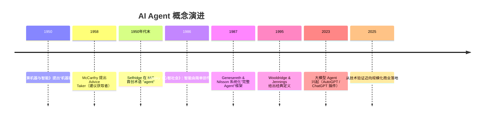
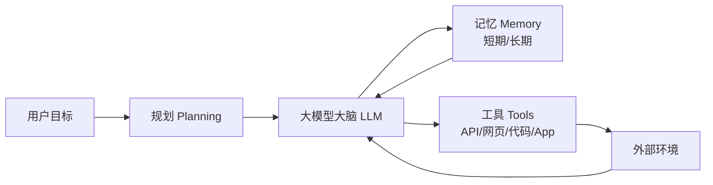
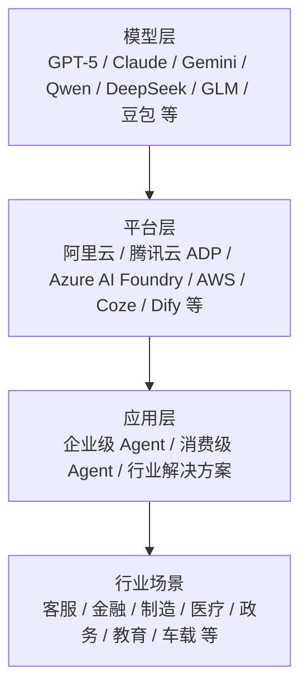
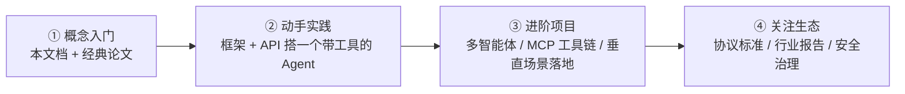

# AI Agent（智能体）学习资料 

> 面向开发者、产品经理与研究者的系统性入门资料。
> 本资料为该时点的行业快照，引用数据均标注口径与来源；后续如出现更新进展，以官方发布为准。

---

## 目录

1. [什么是 Agent](#1-什么是-agent)
2. [概念演进简史](#2-概念演进简史)
3. [技术架构与核心机制](#3-技术架构与核心机制)
4. [主流开发框架与协议](#4-主流开发框架与协议)
5. [2025 年 9 月行业全景](#5-2025-年-9-月行业全景)
6. [典型应用场景](#6-典型应用场景)
7. [挑战与风险](#7-挑战与风险)
8. [学习路径与资源](#8-学习路径与资源)
9. [术语表](#9-术语表)

---

## 1. 什么是 Agent

### 1.1 经典学术定义

"智能体（Agent）"并非新概念。1995 年，Michael Wooldridge 与 Nicholas Jennings 在论文
*Intelligent Agents: Theory and Practice* 中给出了至今引用最广的定义，智能体应具备四大属性：

| 属性 | 含义 |
| --- | --- |
| **自主性（Autonomy）** | 无需人类或其他智能体直接干预即可运行，并对自己行为与内部状态有一定控制 |
| **社会性（Social ability）** | 能与其他智能体或人类交互协作，共同完成任务 |
| **反应性（Reactivity）** | 能感知环境变化并作出及时响应 |
| **主动性（Pro-activeness）** | 不仅响应指令，还能主动采取目标导向的行动 |

### 1.2 大模型时代的 Agent

2023 年以来，大语言模型（LLM）让 Agent 从"学术概念"变成"工程现实"。今天的 **AI Agent / 智能体**通常指：

> 以**大语言模型为"大脑"**，通过**规划（Planning）、记忆（Memory）与工具调用（Tool Use）**，
> 自主完成复杂任务的智能系统。

业界常用来区分的比喻：

- **Chatbot（聊天机器人）**：AI 有了"大脑和嘴巴"——能理解与生成语言，但只是被动问答；
- **Copilot（辅助）**：AI 辅助人类做决策、补全内容，人在回路中；
- **Agent（智能体）**：AI 在此基础上装上了"手脚"——接收的是**目标**而非逐条指令，能自主规划、调用工具、交付结果。

一个典型对比：

| 维度 | 传统 Chatbot | AI Agent |
| --- | --- | --- |
| 输入 | 指令（"帮我写一封邮件"） | 目标（"安排下周的团队建设活动"） |
| 执行 | 回答/生成文本，对话终止 | 拆解任务 → 搜索/预订/对比 → 交付可执行结果 |
| 工具 | 基本无 | 可调用网页、API、代码、App 等外部工具 |
| 状态 | 无状态或短上下文 | 有记忆，可多轮规划与自我修正 |

---

## 2. 概念演进简史

| 时间 | 事件 | 意义 |
| --- | --- | --- |
| 1950 | 图灵发表《计算机器与智能》 | 提出机器能否思考的哲学命题，思想起点 |
| 1958 | 麦卡锡（John McCarthy）提出"建议获取者"（Advice Taker） | 第一个完整的 AI 智能体系统提案，概念正式进入技术层面 |
| 1950 年代末 | 奥利弗·塞尔弗里奇（Oliver Selfridge）首创术语 "agent" | "智能体"一词由此得名 |
| 1986 | 明斯基（Marvin Minsky）《心智社会》 | 智能由大量无智能的简单部件交互涌现 |
| 1987 | 吉内塞雷斯 & 尼尔森提出"完整 Agent"理论 | 将 Agent 定义为"感知—推理—执行"闭环系统 |
| 1995 | 伍尔德里奇 & 詹宁斯发表经典论文 | 确立自主性、社会性、反应性、主动性四大属性 |
| 2023 | ChatGPT 插件、AutoGPT 等出现 | 大模型让"能说"的 AI 开始"会做"，Agent 成为热点 |
| 2024–2025 | MCP、A2A 等协议诞生；Operator、Manus、Deep Research 等产品涌现 | 技术标准化，产品从实验室走向真实场景 |
| 2025 | 行业共识：**规模化商业落地关键节点** | 重心从"能不能对话/推理"转向"能不能落地、增效、闭环" |

---

## 3. 技术架构与核心机制

### 3.1 经典四要素架构

- **大脑（LLM）**：负责理解、推理与决策，是整个系统的核心；
- **规划（Planning）**：把大目标拆解为子任务，决定执行顺序，必要时自我修正（如 ReAct、CoT、任务分解）；
- **记忆（Memory）**：短期记忆（当前对话/任务上下文）+ 长期记忆（跨会话的知识、用户偏好、历史经验）；
- **工具（Tools）**：让 Agent 突破语言边界，真正"动手"——搜索、调用 API、操作浏览器、读写文件、执行代码等。

### 3.2 关键技术机制

| 机制 | 全称/说明 | 作用 |
| --- | --- | --- |
| **Function Calling / Tool Use** | 让模型输出结构化调用指令，由程序执行函数 | Agent 与外部世界交互的基础能力 |
| **ReAct** | 推理（Reason）+ 行动（Act）交替进行 | 边思考边行动，减少幻觉、提高任务成功率 |
| **CoT（思维链）** | 让模型逐步推理再作答 | 提升复杂推理能力 |
| **RAG（检索增强生成）** | 先从知识库检索相关文档，再生成回答 | 引入外部知识，缓解知识过时与幻觉 |
| **Agentic RAG** | 由 Agent 自主决定检索策略与多轮检索 | 更复杂的知识问答，2025 年主流方向 |
| **长期记忆** | 向量数据库 / 结构化存储用户与任务历史 | 支持跨会话个性化与持续任务 |
| **多智能体协作（Multi-Agent）** | 多个专职 Agent 分工、编排、互相调用 | 复杂任务拆解（如 MetaGPT 模拟软件团队） |
| **人机协同（Human-in-the-loop）** | 关键节点由人确认/干预 | 提高可靠性，适合高风险场景 |

---

## 4. 主流开发框架与协议

### 4.1 开发框架（截至 2025 年 9 月）

| 框架 / 平台 | 特点 | 语言 | 适用场景 |
| --- | --- | --- | --- |
| LangChain / LangGraph | 生态最全；LangGraph 适合复杂可控的状态图流程 | Python / JS | 生产级复杂流程、多步骤编排 |
| LlamaIndex | 以 RAG / 知识库见长 | Python | 知识问答、文档理解 |
| CrewAI | 低门槛多角色"团队"协作 | Python | 快速原型、多智能体团队 |
| MetaGPT | 模拟软件公司流程，多角色分工 | Python | 软件工程、代码生成 |
| Microsoft Agent Framework / AI Foundry Agent Service | 微软生态、企业级编排（2025 年已商用） | .NET / Python | 企业级多 Agent 编排 |
| OpenAI Agents SDK | 官方 SDK，委托（handoff）模式 | Python | OpenAI 生态快速开发 |
| Claude Agent SDK | Anthropic 官方，安全优先 | Python / TS | Anthropic 生态 |
| AutoGPT | 早期标杆，自主任务循环 | Python | 学习/原型 |
| 字节 Coze / 扣子 | 低代码智能体平台，插件生态 | 无代码/低代码 | 快速搭建 Bot、客服、工作流 |
| Dify | 开源 LLMOps 平台，Agent + 工作流 | 低代码 | 企业应用快速落地 |
| 通义 ModelStudio-ADK / ADP | 阿里云智能体开发框架与低代码平台 | Python / 低代码 | 深度研究、企业场景 |

### 4.2 关键协议（Agent 生态的"基础设施"）

| 协议 | 提出方/时间 | 定位 | 一句话理解 |
| --- | --- | --- | --- |
| **MCP**（Model Context Protocol） | Anthropic，2024 年 11 月 | 模型 ↔ 外部工具/数据源 的标准化接口 | "AI 世界的 USB-C"；OpenAI 于 2025 年 3 月官方采纳 |
| **A2A**（Agent2Agent） | Google，2025 年 4 月 | 智能体 ↔ 智能体 的通信协议 | 让不同厂商的 Agent 互相协作、传递任务 |

> **互补关系**：MCP 解决"Agent 怎么用工具"，A2A 解决"Agent 之间怎么协作"。二者共同构成智能体互操作的基础。

---

## 5. 2025 年 9 月行业全景

### 5.1 市场数据（口径以来源为准）

| 数据 | 数值 | 口径/来源 |
| --- | --- | --- |
| 中国智能体市场规模（2024） | 47.5 亿元（同比 +64.4%） | 赛迪顾问 |
| 中国智能体市场规模（2025E） | 78.4 亿元（增速超 60%） | 赛迪顾问 |
| 中国企业级智能体市场规模（2025） | 突破 232 亿元，年复合增速约 120% | 《人民日报海外版》（另一口径） |
| 全球 AI 智能体市场规模（2024 → 2025） | 约 52.9 亿 → 113 亿美元 | 第三方研究机构综述 |
| 企业部署预测 | 2025 年 25% 企业部署生成式 AI 智能代理；2027 年升至 50% | 德勤预测 |

**行业共识**（中国信通院）：随着大模型技术更新逐渐放缓，产业重心加速向落地应用迁移，
**2025 年成为智能体大规模商业化落地的关键节点**。

### 5.2 竞争格局：从单点模型到"模型—平台—生态"

- **模型层**：提供"大脑"。2025 年 8 月 OpenAI 发布 GPT-5，国内 Qwen、DeepSeek、GLM、豆包等持续迭代；
- **平台层**：提供"脚手架"。云厂商竞争已从单点模型升级为"模型—平台—生态"的系统化作战；
- **应用层**：企业级与消费级 Agent 产品密集上线，"能否落地、能否增效、能否闭环"成为价值标尺。

---

## 6. 典型应用场景

| 场景 | 代表案例 | 成熟度 |
| --- | --- | --- |
| 智能客服 | 上海联通 AI 客服智能体：语音交互、智能填充、套餐推荐 | ★★★★ 高 |
| 企业办公 | 腾讯会议 AI 纪要（用量同比 +150%）；CodeBuddy 编码提效约 40% | ★★★★ 高 |
| 软件开发 | 代码 Agent（如通义 DeepResearch 类、CodeBuddy、Devin 等） | ★★★☆ 较高 |
| 金融 | 智能投研、风控、合规审查类 Agent 规模化试点 | ★★★☆ 较高 |
| 工业制造 | 智能质检 Agent：交付周期由 3 个月缩短至 0.5–1 个月 | ★★★☆ 较高 |
| 医疗健康 | 诊疗辅助、健康管理类智能体进入临床验证 | ★★☆ 中 |
| 政务 | 城市超级智能体、政务问答系统在多地试点 | ★★☆ 中 |
| 教育 | 智能解题、作业批改类 Agent 落地 | ★★☆ 中 |
| 消费端 | 手机语音助手升级为智能体；车载智能体（小度想想 2.0） | ★★☆ 中 |
| 酒店/文旅 | 华住"华小 AI"智能管家：服务准确率约 95% | ★★★☆ 较高 |

> 规律：**数字化基础越好、任务边界越清晰、价值越可量化的领域，Agent 落地越快**。

---

## 7. 挑战与风险

1. **幻觉与错误放大**：Agent 基于大模型，天然存在幻觉；在链式调用中，微小错误会被后续步骤不断引用并放大，在金融报告、合同审核、医疗问诊等高准确性场景尤为致命。
2. **安全与隐私**：高自主性、高权限带来越权操作、数据泄露、行为失控等风险，需要权限管控与全生命周期安全机制。
3. **标准与互操作**：单智能体工具调用壁垒、跨平台数据壁垒、组件兼容性不一，导致跨工具调用成本高（MCP/A2A 正在缓解，但标准仍在统一中）。
4. **成本与 ROI**：研发与运营成本偏高，"试点成功、规模化失败"是普遍现象，商业模式仍在从"卖调用量"向"按结果付费"演进。
5. **治理与责任**：智能体行为责任认定、伦理规范与监管框架仍在建设中，国内外均在推进相关政策与标准。

---

## 8. 学习路径与资源

### 8.1 推荐学习路径

### 8.2 经典论文与文档

- **Wooldridge & Jennings (1995)** — *Intelligent Agents: Theory and Practice*（经典定义）
- **Yao et al. (2022)** — *ReAct: Synergizing Reasoning and Acting in Language Models*（推理+行动范式）
- **Schick et al. (2023)** — *Toolformer: Language Models Can Teach Themselves to Use Tools*（工具学习）
- **Xi et al. (2023)** — *The Rise and Potential of Large Language Model Based Agents: A Survey*（LLM Agent 综述）
- **MCP 官方文档** — modelcontextprotocol.io（工具互连标准）
- **A2A 协议文档** — 由 Google 于 2025 年 4 月开源

### 8.3 课程与开源项目

- **课程**：DeepLearning.AI 的 LangGraph / Agent 系列短课；Hugging Face Agents Course
- **官方教程**：Anthropic "Building Effective Agents"；OpenAI Cookbook
- **开源项目**：AutoGPT、MetaGPT、LangGraph 官方示例、CrewAI、OpenClaw、Dify
- **低代码试手**：字节 Coze（扣子）、Dify —— 不写代码即可搭建第一个智能体

### 8.4 上手建议（72 小时速通）

1. 用 Coze 或 Dify 搭一个"能搜网页 + 写周报"的 Agent，感受目标驱动与工具调用；
2. 用任意大模型 API 实现一次 Function Calling，再实现一个 ReAct 循环；
3. 给 Agent 接一个 MCP Server（如文件系统或数据库），理解"USB-C for AI"；
4. 读 2–3 篇行业报告（赛迪、信通院、Gartner 等），建立市场与竞争认知。

---

## 9. 术语表

| 术语 | 说明 |
| --- | --- |
| **Agent / 智能体** | 能感知、规划、决策、记忆并调用工具自主完成任务的计算系统 |
| **LLM Agent** | 以大语言模型为核心大脑的智能体 |
| **Multi-Agent System（MAS）** | 多智能体系统，多个 Agent 分工协作完成复杂任务 |
| **Function Calling** | 让模型输出结构化函数调用指令，由程序执行，实现工具交互 |
| **ReAct** | Reasoning + Acting，推理与行动交替进行的智能体范式 |
| **CoT（思维链）** | Chain-of-Thought，引导模型逐步推理再作答 |
| **RAG** | Retrieval-Augmented Generation，检索增强生成 |
| **MCP** | Model Context Protocol，模型上下文协议，连接模型与工具/数据的开放标准 |
| **A2A** | Agent2Agent，智能体之间的通信协作协议 |
| **OS Agent** | 能直接操作操作系统/电脑界面的智能体 |
| **Deep Research** | 深度研究型 Agent，可自主多步检索并产出研究报告 |
| **Agentic Workflow** | 智能体驱动的自动化工作流，Agent 自主编排多个步骤 |
| **Human-in-the-loop** | 人在回路，关键环节由人类确认或干预 |
| **幻觉（Hallucination）** | 模型生成看似合理但错误的内容，是 Agent 的主要风险源 |

