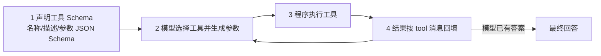

# Function Calling：让模型学会"调用函数"


> 「AI Agent 工程实践」系列第 4 篇，Agent 的"手脚"。
> 上一篇：[提示词工程](./prompt-engineering.md)
> 系列后续：意图路由 / HITL

## 什么是 Function Calling

Function Calling（函数调用）是让模型输出**结构化调用指令**（选哪个工具 + 传什么参数），由你的程序执行，再把结果回填给模型继续推理。

一句话理解分工：**模型负责决策（选工具、定参数），程序负责执行（真正跑函数）**。

```
用户: 北京今天多少度？
        │
        ▼
模型: 需要 getWeather({city: "北京"})   ← 模型只"输出意图"
        │
        ▼
程序: 真正调用天气 API                    ← 程序只"执行"
        │
        ▼
模型: 基于结果回答 "北京今天 25℃，晴"    ← 模型再"收尾"
```

它是 Agent 与外部世界交互的基础能力，[Agent 篇](./agent.md) 里手写的工具调用，生产环境都应该升级成原生 Function Calling。

## 原理（四步）



## 第一版：正则解析（脆弱）

最早的做法是让模型在文本里输出 `callWeather("北京")`，再用正则提取：

```js
const m = reply.match(/callWeather\(\s*"([^"]+)"\s*\)/);
if (m) return await getWeather(m[1]);
```

问题显而易见：模型输出稍微一飘（多空格、换引号、加注释），正则就挂。**文本解析永远追不上模型的自由发挥**。

## 第二版：JSON 结构化输出

改进思路：让模型输出固定结构的 JSON，用 `JSON.parse` 解析：

```js
// 模型输出：{"name": "getWeather", "arguments": {"city": "北京"}}
const parsed = JSON.parse(reply);
const result = await tools[parsed.name](parsed.arguments);
```

比正则稳，但仍是"软约束"——模型可能输出多余字段、非法 JSON、甚至 markdown 包裹。得靠 Prompt 反复强调 + `try/catch` 容错重试，工程上很别扭。

## 第三版：原生 Function Calling

现在主流大模型 API（OpenAI、豆包、Claude 等）都原生支持：你在请求里声明工具 Schema，模型**在协议层面**结构化地返回 `tool_calls`，不再依赖文本格式。

**① 声明工具**：

```js
const tools = [{
  type: 'function',
  function: {
    name: 'getWeather',
    description: '查询指定城市的当前天气',
    parameters: {
      type: 'object',
      properties: {
        city: { type: 'string', description: '城市名，如：北京' }
      },
      required: ['city']
    }
  }
}];
```

`description` 是模型选工具的**唯一依据**，务必写清"什么时候用、参数是什么含义"。

**② 请求 + 处理 tool_calls**：

```js
const messages = [
  { role: 'system', content: '你是天气助手' },
  { role: 'user', content: '北京今天多少度？' }
];

// 第一次调用：模型返回工具调用指令
const res = await callLLM({ messages, tools });
const toolCalls = res.tool_calls ?? [];

for (const call of toolCalls) {
  // call = { id: 'call_xxx', function: { name: 'getWeather', arguments: '{"city":"北京"}' } }
  const args = JSON.parse(call.function.arguments);   // arguments 是字符串，要 parse
  const result = await executeTool(call.function.name, args);

  // 关键：按 tool_call_id 回填结果
  messages.push({
    role: 'tool',
    tool_call_id: call.id,
    content: JSON.stringify(result)
  });
}

// 第二次调用：模型基于工具结果给出最终回答
const final = await callLLM({ messages, tools });
console.log(final.content);   // 北京今天 25℃，晴
```

和 [Agent 篇](./agent.md) 的手写循环对比，你会发现结构完全一样——**原生 Function Calling 就是把"格式约定"从 Prompt 里搬到了协议层**，可靠性天差地别。

## 并行调用

复杂任务一次可能需要多个工具（查天气 + 查航班）。多数 API 支持一次返回多个 `tool_calls`：

```js
// 并行执行，再按 id 逐个回填
await Promise.all(toolCalls.map(call => executeTool(call.function.name, JSON.parse(call.function.arguments))));

toolCalls.forEach((call, i) => {
  messages.push({ role: 'tool', tool_call_id: call.id, content: results[i] });
});
```

注意：并行调用需要工具**无副作用或副作用安全**，写入/删除类操作慎用并行。

## 注意（坑）

1. **参数幻觉**：模型可能编造参数（比如编一个城市名）。在 `description` 里写清取值范围和默认值，程序侧再做参数白名单校验；
2. **arguments 是字符串**：必须 `JSON.parse`，parse 失败要兜底（让模型重试或报错）；
3. **工具描述决定选型质量**：描述含糊，模型就会乱选工具；
4. **结果回填格式**：用 `role: 'tool'` + `tool_call_id` 一一对应，顺序错乱模型会懵；
5. **结果超长**：回填前截断，否则撑爆上下文；
6. **安全**：工具白名单、参数校验、操作权限一个不能少——模型选中的工具≠可以无脑执行，高风险动作交给 [HITL 篇](./hitl.md) 的确认闸门；
7. **和意图路由的分工**：路由决定"这个请求归谁处理"（哪个 Agent/流程），Function Calling 决定"处理过程中用什么工具"，两者是不同层的问题。

## 总结

| 版本 | 方案 | 可靠性 |
| --- | --- | --- |
| v1 | 正则提取文本调用 | 低，格式一飘就挂 |
| v2 | 让模型输出 JSON + 解析 | 中，靠 Prompt 软约束 |
| v3 | 原生 Function Calling（协议层） | 高，结构化返回 |

一句话：**能用原生就用原生**，别自己造轮子。Function Calling 解决了"模型怎么用工具"，下一篇解决"请求该发给谁"——[意图路由](./intent-routing.md)。
