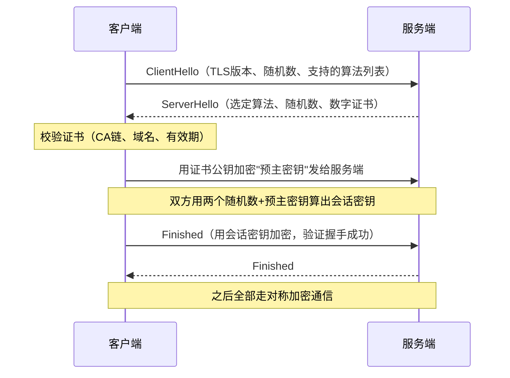

# HTTPS 与 TLS：给 HTTP 加密握手

> 「网络知识」系列第 3 篇。
> 相关：[HTTP 协议](./http2.md) / [TCP 三次握手与四次挥手](./tcp.md)

## 为什么需要 HTTPS

HTTP 是明文传输，等于在大街上喊话：

1. **被窃听**：中间人能看到全部内容（密码、cookie）；
2. **被篡改**：内容可以被改（插广告、改金额）；
3. **被冒充**：你不知道对面是不是真服务器（钓鱼）。

HTTPS = HTTP + TLS，用加密解决这三件事：**机密性、完整性、身份认证**。

## 核心难题：怎么加密

先看两种加密：

| 类型 | 特点 | 问题 |
| --- | --- | --- |
| 对称加密 | 一把钥匙加密解密，快 | 钥匙怎么安全传给对方？ |
| 非对称加密 | 公钥加密、私钥解密，公钥随便发 | 慢，不适合传大量数据 |

于是 TLS 的做法是**混合加密**：

- 用**非对称加密**安全地协商出一个共同的**会话密钥**；
- 之后的数据全部用**对称加密**（快）。

## TLS 1.2 握手过程



关键点：

1. **两个随机数**：客户端、服务端各出一个，防止密钥被完全预测；
2. **预主密钥**：客户端生成，用**服务器的公钥**加密传输，只有服务器私钥能解开——这就是非对称加密的用武之地；
3. **会话密钥**：两个随机数 + 预主密钥，双方各自算出**同一个**对称密钥；
4. **Finished**：双方用会话密钥互相验证，确认之前没人篡改。

## 数字证书与 CA

客户端怎么信任"这把公钥真是服务器的"？靠**证书链**：

```
根证书（内置在系统/浏览器）
   └── 签发 → 中间证书
             └── 签发 → 服务器证书（含域名、公钥、有效期）
```

- 服务器把证书发给客户端；
- 客户端沿着证书链向上验证，最终信任**系统内置的根证书**；
- 校验三件事：**证书链可追溯、域名匹配、未过期/未被吊销**。

中间人攻击的场景就是：攻击者想冒充服务器，但他没有 CA 签发的合法证书——客户端校验证书失败，就会警告"连接不安全"。

## TLS 1.3 简化了什么

| 对比 | TLS 1.2 | TLS 1.3 |
| --- | --- | --- |
| 握手往返 | 2 个 RTT | 1 个 RTT（首次） |
| 密钥交换 | RSA / ECDHE 等多种 | 只留 ECDHE 等前向安全算法 |
| 协商加密 | 可降级到弱算法 | 移除旧算法，防降级攻击 |

少一次往返，就是少一次延迟——对移动端弱网很值钱。

## 注意（坑）

1. **证书过期**是线上最常见的 HTTPS 事故，记得监控和自动续期（Let's Encrypt 可免费自动续）；
2. **证书≠加密**：证书解决"你是谁"，加密解决"内容不被看"，两个都要；
3. **RSA 密钥交换无前向保密**：私钥泄露，之前抓包记录全被解开；TLS 1.3 强制 ECDHE（每次会话密钥独立），就是这个原因；
4. **混合加密的"混合"别搞反**：**握手用非对称、数据用对称**，把关系记牢；
5. **握手在 TCP 三次握手之后**：先 TCP 建连，再 TLS 握手，最后才发 HTTP 请求——所以 HTTPS 比 HTTP 多了至少一个 RTT。

## 总结

HTTPS 用 **证书做身份认证 + 非对称加密协商会话密钥 + 对称加密传数据**。本质是把"喊话"变成"对暗号"，暗号只有你们两个知道，并且每次会话都换。

至此网络知识三篇（HTTP → TCP → HTTPS）闭环：HTTP 是规则，TCP 是运输，HTTPS 是保险箱。索引见 [README](../README.md)。
