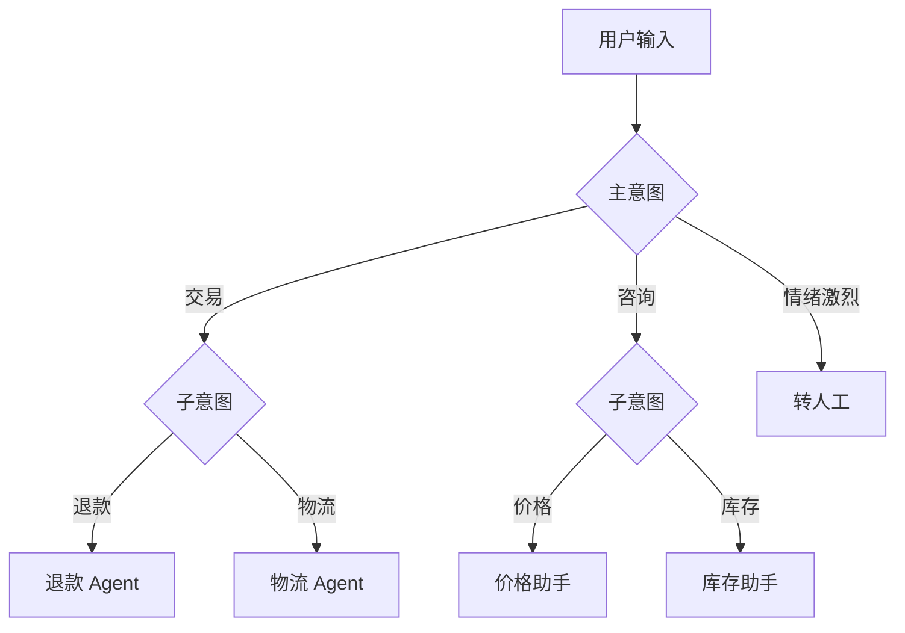

# 意图路由：把请求分发给对的处理器


> 「AI Agent 工程实践」系列第 5 篇，多 Agent / 多技能系统的调度中枢。
> 上一篇：[Function Calling](./function-calling.md)
> 系列后续：HITL 人在回路

## 什么是意图路由

意图路由（Intent Routing）是：**判断用户输入"想干什么"（意图），把它分发给对应的处理器（Handler / Agent）**。

为什么不能一个 Prompt 干所有事？因为场景一多，单个 Prompt 既要懂售前又要懂售后、既要查价格又要算退款，必然两头不讨好，还烧 token。正确的做法是**拆成多个专业 Handler，每个只干一件事**，前面加一个路由器分流。

```text
用户输入
   │
   ▼
┌──────────┐  意图识别  ┌──────────┐
│  路由器   │ ────────→ │ 退款 Agent │
└──────────┘           ├──────────┤
                       │ 物流 Agent │
                       ├──────────┤
                       │ 人工客服   │
                       └──────────┘
```

## 四种做法对比

| 方法 | 速度 | 准确率 | 成本 | 适用场景 |
| --- | --- | --- | --- | --- |
| 关键词 / 正则 | 最快 | 低（同义、长尾表达弱） | 几乎为零 | 意图少且表达固定 |
| 小分类模型 | 快 | 中 | 需标注数据 + 训练 | 意图固定、量大 |
| 向量相似度 | 快 | 中高 | 需维护示例库 | 意图有充分示例 |
| LLM 分类 | 慢（几百 ms+） | 高（理解长尾） | token 成本 | 表达多样、意图多 |

**工程实践通常混合使用**：快的方法兜底，慢的方法兜准。

## 第一版：关键词匹配

```js
const ROUTES = [
  { intent: '退款', keywords: ['退款', '退钱', '退货退款', '退差价'] },
  { intent: '物流', keywords: ['物流', '快递', '发货', '到哪了', '物流单号'] },
  { intent: '人工', keywords: ['人工', '客服', '投诉', '转人工'] }
];

function route(text) {
  for (const r of ROUTES) {
    if (r.keywords.some(k => text.includes(k))) return r.intent;
  }
  return '其他';
}

route('我要退款');          // 退款
route('快递到哪了？');       // 物流
```

能跑，但问题一堆：**同义表达漏**（"钱什么时候退"没命中"退款"？其实命中了，但"我的东西寄丢了"就漏了）、**一词多义错**（"人工呼吸怎么做"被路由到"人工"）。

## 第二版：正则 + 优先级

用正则表达更丰富的模式，靠顺序表达优先级：

```js
const ROUTES = [
  { intent: '人工', pattern: /转人工|找客服|人工客服|投诉/ },
  { intent: '退款', pattern: /退(款|钱|差价)|退款到账/ },
  { intent: '物流', pattern: /(快递|物流|货).{0,4}(到哪|发货|单号)|物流信息/ }
];
```

比关键词稳，但**维护成本高**，长尾表达永远有漏网之鱼，正则写多了自己也看不懂。

## 第三版：LLM 意图分类

把判断交给模型，长尾表达也能理解：

```js
async function routeByLLM(text) {
  const res = await callLLM({
    messages: [{
      role: 'user',
      content: `判断用户输入属于哪个意图：${['退款', '物流', '人工', '其他'].join(' / ')}
只输出 JSON：{"intent": "...", "confidence": 0~1, "reason": "一句话理由"}
输入：${text}`
    }]
  });
  return JSON.parse(res);
}
```

更稳的姿势是配合 [Function Calling](./function-calling.md) 的结构化输出，让模型在协议层返回意图而不是拼 JSON 文本。

优点：理解长尾、能解释理由；缺点：**延迟和成本**——每次路由都是一次模型调用。所以生产上常用"**快通道 + 慢通道**"：

```js
async function routeSmart(text) {
  const fast = route(text);              // ① 关键词/正则先试
  if (fast !== '其他') return fast;      // 命中直接用
  return routeByLLM(text);               // ② 没命中再上 LLM
}
```

## 第四版：向量相似度路由（示例路由）

思路：每个意图准备 N 条"典型说法"，向量化后入库；用户输入向量化后找最近邻，距离小于阈值才命中，否则兜底。

```js
// 意图示例库（离线构建）
const intentExamples = {
  退款: ['我要退款', '钱什么时候退给我', '申请退货退款'],
  物流: ['快递到哪了', '我的货怎么还没发', '查一下物流单号']
};
// 每条示例 → embed() → 存索引，标注所属意图

async function routeByVector(text) {
  const qv = await embed(text);
  let best = null;
  for (const [intent, examples] of Object.entries(intentExamples)) {
    for (const ex of examples) {
      const score = cosine(qv, ex.vector);       // 余弦相似度
      if (!best || score > best.score) best = { intent, score };
    }
  }
  // 阈值兜底：相似度太低就当"不知道"，别硬路由
  return best.score > 0.75 ? best.intent : '其他';
}
```

**阈值是灵魂**：没有阈值兜底，随便一句话都会被硬塞进最近的意图里。

## 兜底与升级

路由不可能永远正确，必须设计"不知道怎么办"：

| 场景 | 处理 |
| --- | --- |
| 未命中任何意图 | 兜底 Handler（通用问答 / 引导） |
| 置信度低 | 反问澄清："您是想查物流还是申请退款？" |
| 多意图并存 | 拆成多次路由，或交给可处理多意图的流程 |
| 高风险 / 用户不满意 | 升级转人工（配合 [HITL 篇](./hitl.md)） |

**原则：误路由比拒绝更糟**——把"投诉"误路由到"商品推荐"，比直接转人工伤害大得多。所以低置信一律给兜底。

## 一个多级路由示例

真实系统里路由通常是树状的：



第一级粗分（交易/咨询/人工），第二级细分（退款/物流/价格/库存），每级都是独立的路由决策。好处是每个路由器的意图集都很小，准确率高，模型调用也省。

## 注意

1. **意图要互斥**："退款"和"售后"别重叠，重叠了就靠优先级裁决；
2. **误路由成本 > 拒绝成本**：低置信给兜底，别硬塞；
3. **必须评估**：建一个路由测试集（含长尾表达），定期跑准确率和兜底率；
4. **路由是第一个决策点**：它错了，后面全错，值得投入最多的质量保障。

## 总结

路由器的演进：**关键词 → 正则 → LLM 分类 → 向量路由 → 混合（快通道 + 慢通道）**。别一上来就上 LLM，先看你的意图集有多大、表达有多野。记住两句话：**阈值兜底不能少，误路由比拒绝更糟**。

下一篇，给 Agent 装上最后一道安全闸——[HITL 人在回路](./hitl.md)。
