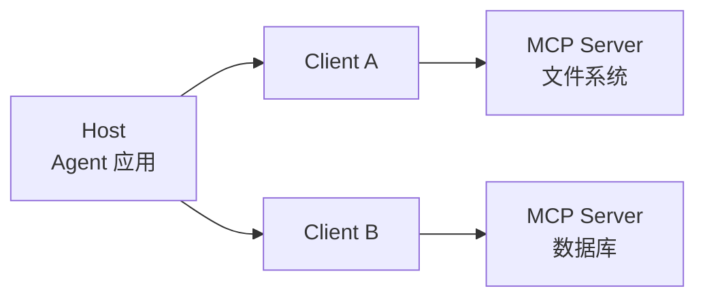

# MCP：给 Agent 接工具的"USB-C"

> 「AI Agent 工程实践」系列 · 进阶篇第 4 篇。
> AI 工具互操作标准。
> 相关：[Function Calling](./function-calling.md) / [AI Agent 学习资料](./ai-agent-learning.md)

## 什么是 MCP

MCP（Model Context Protocol，模型上下文协议）由 Anthropic 于 2024 年 11 月开源，OpenAI 于 2025 年 3 月采纳。

目标：用**一套标准接口**连接"模型 ↔ 工具/数据源"，避免每个工具写一套私有集成。业界比喻："AI 世界的 USB-C"。

## 架构

| 角色 | 说明 |
| --- | --- |
| Host（宿主） | Agent 应用 / 客户端 |
| Client | Host 内部的协议客户端，负责连一个 Server |
| Server | 暴露能力的一端：文件系统、数据库、搜索、内部系统…… |



一个 Host 可以同时连多个 Server，每个 Server 暴露一组能力。

## 三大原语

| 原语 | 作用 | 类比 |
| --- | --- | --- |
| **Tools（工具）** | 可执行操作，模型可调用 | Function Calling 的标准化 |
| **Resources（资源）** | 可读取的数据 | 只读数据源 |
| **Prompts（提示词模板）** | 可复用的提示 | 提示词包 |

传输基于 JSON-RPC 2.0，走 stdio 或 HTTP/SSE。

关键点：**能力描述（工具名 + 描述 + 参数 schema）由 Server 提供，模型按描述选择**——机制和 Function Calling 同构，只是标准化了"怎么声明、怎么发现、怎么调用"。

## 快速上手（概念）

```text
写一个 MCP Server  =  实现 tools / resources / prompts 的 JSON-RPC 处理
注册到 Host        =  模型自动"看到"这些工具
```

一次实现，LangGraph、Claude 等支持 MCP 的框架都能复用，不用每家写一遍集成。

## 与 Function Calling 的关系

- **Function Calling**：模型的一种能力——怎么选工具、输出结构化调用指令；
- **MCP**：工具互连的标准——工具怎么被描述、发现、调用。

两者互补：模型用 Function Calling 的机制，通过 MCP 的标准接口去调用任何工具。

## 注意（坑）

1. **MCP 不解决安全**：它只标准化"怎么连"，Server 的权限、数据边界还要自己管；
2. **不是所有框架都支持**：接入前先确认目标框架对 MCP 的支持；
3. **工具描述质量不变**：MCP 不改变"描述决定调用质量"这条铁律；
4. **别混淆 MCP 和 A2A**：MCP 解决 Agent↔工具，A2A 解决 Agent↔Agent（见 [A2A](./a2a.md)）。

## 总结

MCP = 工具的标准化插口。做 Agent 工具集成时，优先找"支持 MCP 的 Server"，一次实现、到处复用。下一篇讲 Agent 之间怎么协作——[A2A 协议](./a2a.md)。
