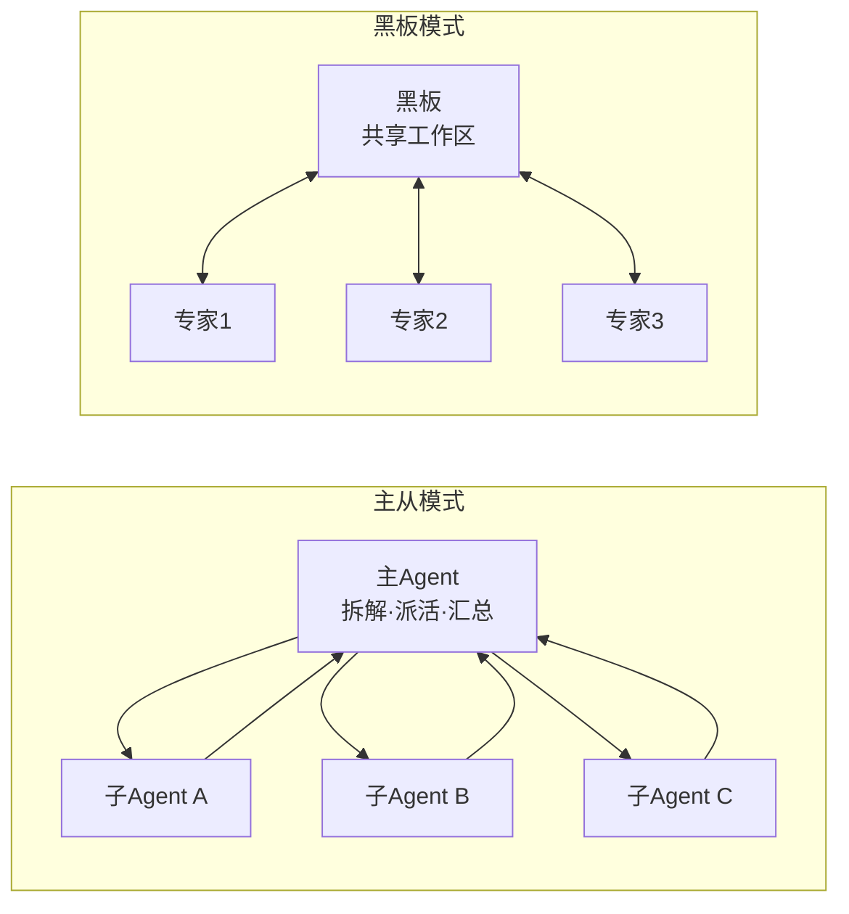

# 多 Agent 编排：让一群 Agent 协作干活

> 「AI Agent 工程实践」系列 · 生产篇第 1 篇，多体协作。
> 相关：[MCP 协议](./mcp.md) / [A2A 协议](./a2a.md) / [SKILL 技能系统](./skill.md)

## 为什么需要多个 Agent

单个 Agent 做到一定规模就会撞墙：

1. **上下文爆炸**：一个 Agent 要会检索、会写代码、会查数据库、会审合同，全部技能和记忆塞进一个上下文，互相干扰，token 也撑不住；
2. **职责耦合**：改检索逻辑会影响写作文风，牵一发动全身；
3. **专业分工**：现实团队本来就是"研究员 + 开发 + 审稿"各司其职，让一个 Agent 全干，样样稀松。

多 Agent 的核心思想：**拆成多个角色，各管一段，用编排机制串起来**。

## 三种协作模式

### 1. 主从模式（Orchestrator-Worker）

一个主 Agent 负责拆解任务、派活、汇总，子 Agent 只干自己的活，结果交回。

### 2. 黑板模式（Blackboard）

没有中央指挥，多个专家 Agent 读写一块共享"黑板"，谁有进展就往上写，别人看到后继续推进。



第三种是**协商模式**（Peer）：Agent 之间平级对话、讨价还价（比如买家和卖家 Agent 谈价格），无中心，靠协议通信。

## 代码示意：最简主从编排

```js
const workers = {
  research: async (task) => ({ type: 'research', result: await search(task) }),
  write: async (task) => ({ type: 'write', result: await compose(task) }),
  review: async (task) => ({ type: 'review', result: await critique(task) }),
};

async function orchestrate(task) {
  const plan = await planner(task); // 主 Agent：拆解成步骤
  const results = [];

  for (const step of plan.steps) {
    const worker = workers[step.worker]; // 按角色分发
    results.push(await worker(step.task));
  }

  return synthesizer(results); // 主 Agent：汇总成最终答案
}
```

真实系统里每个 worker 都可以是独立部署的服务（A2A 协议互相调用），主 Agent 只做**调度和汇总**，不参与具体干活。

## 三种模式对比

| 模式 | 有中心吗 | 适合场景 | 缺点 |
| --- | --- | --- | --- |
| 主从 | 有（主 Agent） | 任务可拆解、步骤明确 | 主 Agent 是单点，上下文仍是瓶颈 |
| 黑板 | 无 | 开放性问题、渐进式求解 | 无主心骨，容易跑偏、重复劳动 |
| 协商 | 无 | 多利益方博弈 | 协议复杂，可能谈不拢/死循环 |

## 注意（坑）

1. **主 Agent 上下文仍是瓶颈**：子 Agent 的完整轨迹别全塞回给主 Agent，只回传**结构化摘要**；
2. **结果聚合丢信息**：子 Agent 的中间推理往往比最终结果更值钱，汇总时只拿结论会损失质量；
3. **死循环/踢皮球**：协商模式下 A 等 B、B 等 A，必须设**最大轮次**和超时；
4. **成本放大**：N 个 Agent 各调 N 次模型，成本近似线性增长——不是所有任务都值得多 Agent；
5. **失败传播**：一个子 Agent 出错，主 Agent 可能拿错结果继续跑，子任务要有**重试和标记失败**机制。

## 总结

多 Agent = **角色拆分 + 协作机制**。主从最常用，黑板适合开放探索，协商适合博弈。核心纪律：**上下文隔离 + 结构化传参 + 失败兜底**。

下一篇：[反思与自我修正](./agent-reflection.md)——协作归协作，单个 Agent 出错后怎么自己发现并改。
