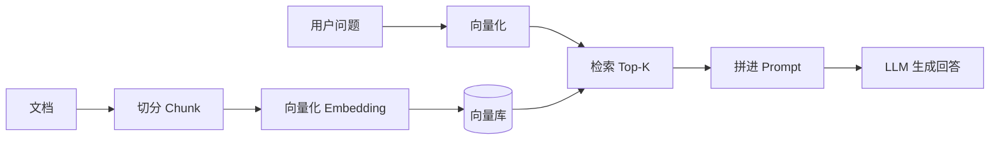

# RAG 检索增强生成：给 LLM 插上外部知识


> 「AI Agent 工程实践」系列第 2 篇，解决 Agent 的"知识短板"。
> 上一篇：[手写一个 Agent：从 ReAct 循环说起](./agent.md)
> 系列后续：提示词工程 / Function Calling / 意图路由 / HITL

## 为什么需要 RAG

LLM 的知识来自训练数据，有三大硬伤：**知识截止**（不知道新事）、**幻觉**（不懂装懂）、**没有私有知识**（公司文档、个人资料一概不知）。RAG（Retrieval-Augmented Generation，检索增强生成）的思路是：**先检索、再生成**——回答前先从知识库里把相关资料捞出来，拼进 Prompt，让模型"看着资料说话"。

| 维度 | 直接问 LLM | RAG |
| --- | --- | --- |
| 知识时效 | 停留在训练截止日 | 知识库随时更新 |
| 幻觉 | 高，编造无依据 | 有依据、可溯源 |
| 私有知识 | 不掌握 | 注入自己的文档 |
| 知识更新成本 | 重训/微调，贵 | 改库即可，便宜 |

## 流水线总览



五个环节：**加载 → 切分 → 向量化 → 检索 → 生成**。前三步是"建索引"（离线），后两步是"用索引"（在线）。

## 第一版：朴素 RAG

用一个可运行的 JS 示例串起整条流水线。

**① 切分**：固定长度 + 重叠，避免一句话被从中间切断：

```js
function chunk(text, size = 500, overlap = 50) {
  const chunks = [];
  for (let i = 0; i < text.length; i += size - overlap) {
    chunks.push(text.slice(i, i + size));
  }
  return chunks;
}
```

**② 向量化 + 存储**：把每个 chunk 转成向量（embedding），存入向量库。生产环境用 faiss / pgvector / 向量数据库；这里用一个内存数组示意：

```js
async function embed(text) {
  // 省略：调用 embedding API（豆包 / OpenAI / 开源模型均可）
  // return await embeddingApi({ input: text });
}

// 建索引（离线）
async function buildIndex(doc) {
  return Promise.all(chunk(doc).map(async (c) => ({
    text: c,
    vector: await embed(c)
  })));
}
```

**③ 检索**：用户问题向量化后，与所有 chunk 算余弦相似度，取 Top-K：

```js
function cosine(a, b) {
  let dot = 0, na = 0, nb = 0;
  for (let i = 0; i < a.length; i++) {
    dot += a[i] * b[i]; na += a[i] * a[i]; nb += b[i] * b[i];
  }
  return dot / (Math.sqrt(na) * Math.sqrt(nb) + 1e-9);
}

async function retrieve(index, question, topK = 3) {
  const qv = await embed(question);
  return index
    .map(item => ({ text: item.text, score: cosine(qv, item.vector) }))
    .sort((a, b) => b.score - a.score)
    .slice(0, topK);
}
```

**④ 生成**：把检索结果拼进 Prompt，让模型"基于资料回答"：

```js
const prompt = `
基于以下资料回答用户问题。如果资料中没有答案，直接说"资料中没有相关内容"，
不要编造。

资料：
${topK.map(c => `[片段] ${c.text}`).join('\n')}

问题：${question}`;
```

这就是"朴素 RAG"，能用，但效果平平。下面三个进阶点按性价比排序。

## 进阶一：切分策略

固定长度切分最省事，但会**把语义拦腰截断**。表格、代码、合同条款被切碎后，检索质量直线下降。

| 策略 | 做法 | 优点 | 缺点 |
| --- | --- | --- | --- |
| 固定长度 | 按字符数 + 重叠 | 简单通用 | 切断语义；chunk 大小难调 |
| 按结构切 | 按标题 / 段落 / Markdown 标题层级切 | 语义完整 | 依赖文档结构规范 |
| 语义切分 | 检测句子/话题边界（如按空行、语义相似度） | 质量最好 | 实现复杂，慢 |

经验值：一般文档 300–800 字一个 chunk 比较合适；**overlap 一定要留**（50–100 字），否则相邻 chunk 交界处的信息会丢失。

## 进阶二：混合检索

向量检索擅长"语义相似"，但对**专有名词、型号、ID、代码**这类词汇很弱——"iPhone 15 Pro Max 256G" 和 "苹果最新旗舰手机" 语义距离可能很远。关键词检索（BM25）恰好互补。

业界标准做法：两路都召回，用 RRF（Reciprocal Rank Fusion）融合排序：

```text
score(d) = Σ  1 / (k + rank_i(d))
            i          其中 k 通常取 60
```

```js
// 两路召回结果：bm25Hits, vectorHits，各带排名
function rrf(bm25Hits, vectorHits, k = 60) {
  const score = new Map();
  bm25Hits.forEach((d, i) => score.set(d.id, (score.get(d.id) || 0) + 1 / (k + i + 1)));
  vectorHits.forEach((d, i) => score.set(d.id, (score.get(d.id) || 0) + 1 / (k + i + 1)));
  return [...score.entries()].sort((a, b) => b[1] - a[1]).map(([id]) => id);
}
```

一句话：**向量捞语义，BM25 捞关键词，RRF 合并**。

## 进阶三：重排 Rerank

两阶段检索是 RAG 精度提升最大的单项投入：

1. **粗排**：bi-encoder（向量）召回 Top-50，快但精度一般；
2. **精排**：cross-encoder 把"问题 + 文档"一起送进模型打分，慢但准，取 Top-3~5 进 Prompt。

Cross-encoder 本质是"逐对判断相关性"，比向量相似度可靠得多。代价是每个候选都要过一遍模型，所以只能用在粗排之后的少量候选上。

## 评估

没有评估的 RAG 就是盲调。至少分两侧看：

| 侧 | 指标 | 说明 |
| --- | --- | --- |
| 检索侧 | Recall@k / MRR | 正确答案有没有被召回到 Top-K 里 |
| 生成侧 | 答案准确率、引用命中率 | 回答是否正确、是否真的引用了检索内容 |

生成侧可以用"LLM-as-judge"（让另一个模型打分）自动化，但高风险场景必须人工抽检。

## 注意（坑）

1. **切分破坏语义**：表格、代码、条款要按结构切，别一刀切；
2. **chunk 太大** → 上下文塞满噪声；**太小** → 信息不完整，模型答不出。500 左右起步，按效果调；
3. **embedding 模型与领域匹配**：通用模型对专业术语（医疗、法律、代码）表现差，必要时换领域模型；
4. **top-k 不是越大越好**：塞 10 个不相关片段进去，幻觉风险反而上升；
5. **知识更新**：文档变了要增量更新或定时重建索引，不然答的是旧知识；
6. **检索不到要诚实**：Prompt 里明确"资料中没有就说没有"，比硬编一个答案强一百倍。

## 总结

RAG 的完整链路：**切分 → 向量化 → 检索 → 拼 Prompt → 生成**。朴素版半小时能跑通；要上生产，按性价比依次做：**结构切分 → 混合检索（RRF）→ 重排 → 评估闭环**。

下一篇我们从"怎么跟模型说话"讲起——[提示词工程](./prompt-engineering.md)。
