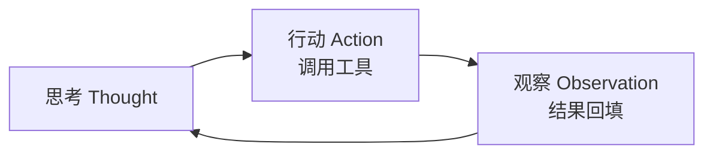
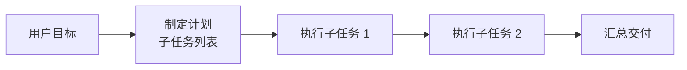

# 推理范式：CoT / ReAct / Plan-and-Execute

> 「AI Agent 工程实践」系列 · 基础篇第 4 篇。
> [手写 Agent](./agent.md) 篇只讲了 ReAct，这篇把模型"思考"的几种范式放在一起对比。
> 相关：提示词工程 / 手写 Agent

## 为什么要讲范式

直接问模型 → 模型"张口就来"，复杂任务容易错。给模型一种**思考方式** → 正确率提升、行为可预测、步骤可追踪。范式就是"思考方式"的模板。

## CoT：思维链

让模型**先一步步推理，再作答**：

```text
❌ "三个人分 9 个苹果，每人几个？"
✅ "请分步计算：总苹果数 9，人数 3，9 ÷ 3 = 3，所以每人 3 个。"
```

常用变体：

- **Zero-shot CoT**：加一句"让我们一步一步思考"，不用给示例；
- **Self-Consistency**：同一问题多次采样，取多数答案（更稳，但调用次数翻倍）。

适用：数学、逻辑、分析类**单轮推理**。
局限：不能调用工具、拿不到外部信息。

## ReAct：边想边做

推理（Reason）与行动（Act）交替：思考 → 调用工具 → 观察结果 → 再思考，直到拿到答案。这是 Agent 的核心范式，完整实现见[手写 Agent](./agent.md) 篇。



适用：需要工具/外部信息的交互式任务（查天气、搜索、调 API）。
局限：每步一次模型调用，慢、贵。

## Plan-and-Execute：先计划后执行

先让模型**制定完整计划**（子任务列表），再逐个执行，最后汇总：



与 ReAct 的核心区别：**ReAct 边想边做，P&E 先计划后做**。
变体：执行中发现计划不准，可**重新规划（re-plan）**。

适用：边界清晰的多步骤任务（写报告：调研 → 提纲 → 成文 → 校对）。
优势：决策次数少、省调用；劣势：计划不准时整体崩。

## 对比

| 范式 | 思考方式 | 工具 | 调用次数 | 适用 |
| --- | --- | --- | --- | --- |
| CoT | 单次深度思考 | 无 | 1 | 纯推理 |
| ReAct | 边想边做 | 有 | 多 | 交互式任务 |
| Plan-and-Execute | 先计划后执行 | 有 | 中 | 多步骤任务 |

## 组合使用

生产 Agent 很少只用一种：

- 整体用 **Plan-and-Execute** 拆任务；
- 单个子任务内部用 **CoT** 推理；
- 需要外部信息时切 **ReAct** 调工具。

范式是"工具箱"，按任务类型选，不是越高级越好。

## 注意（坑）

1. **CoT 不是银弹**：简单任务加 CoT 反而啰嗦、多花 token；
2. **ReAct 的"思考"占输出**：每步的 Thought 都是输出 token，成本更高；
3. **P&E 的计划要可执行**：计划太抽象，执行阶段照样迷路，要允许 re-plan；
4. **选型看任务**：纯推理用 CoT，要动手用 ReAct，多步骤先 P&E。

## 总结

CoT 让模型"想"，ReAct 让模型"想+做"，P&E 让模型"先规划再做"。下一篇讲 Agent 的头号风险——[幻觉：成因与缓解](./hallucination.md)。
