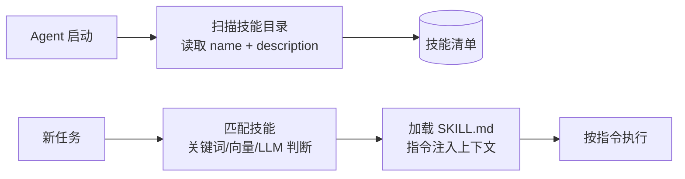

# SKILL 技能系统：把 Agent 能力封装成可复用技能

> 「AI Agent 工程实践」系列 · 进阶篇第 6 篇（进阶篇收尾）。
> Agent 能力组织的"技能包"模式。
> 相关：[Function Calling](./function-calling.md) / [意图路由](./intent-routing.md) / [MCP](./mcp.md)

## 什么是 Skill

Skill（技能）是把**提示词 + 工具 + 执行流程**打包成一个**自包含、可发现、可复用**的能力单元。

类比：函数是代码的复用单元，Skill 是 Agent 能力的复用单元。一个 Agent 可以挂很多 Skill、按需加载，而不是把所有能力都塞进一个巨大的 system prompt。

## 为什么需要 Skill

1. **上下文瘦身**：全部能力写进 system prompt → 巨大且互相干扰；按需加载 → 只注入当前任务需要的指令；
2. **能力复用**：同一个"搜索 + 总结"技能，可以在多个 Agent 里复用；
3. **可维护**：一个技能一个文件，改技能不动主流程；
4. **可扩展**：技能包可以共享、插拔，生态化。

## Skill 的结构

典型的技能包：

```text
code-review/
├── SKILL.md          # 技能说明（核心！）
└── assets/           # 技能要用的资源/脚本
```

`SKILL.md` 的关键字段：

| 字段 | 作用 |
| --- | --- |
| `name` | 技能名，见名知义 |
| `description` | **何时用、解决什么**——发现与匹配的依据，必须写清触发条件 |
| 正文 | 具体指令：执行步骤、用到的工具、输出格式、注意事项 |

## 发现与加载



- **发现**：启动时扫描技能包，形成"技能清单"；
- **匹配**：根据当前任务挑技能（关键词 / 向量相似度 / LLM 判断）；
- **加载**：读取 SKILL.md，把技能指令注入上下文；
- **执行**：按技能指令跑（内部可调用工具）。

## 与相关概念的区别

| 概念 | 是什么 | 与 Skill 的关系 |
| --- | --- | --- |
| Function Calling | 模型调用函数的机制 | Skill 内部用 Function Calling 调工具 |
| MCP | 工具互连标准 | Skill 可以封装 MCP 工具的使用方式 |
| 子 Agent | 独立运行的执行体 | Skill 是"指令包"，子 Agent 是"执行体"，技能可被子 Agent 使用 |
| 意图路由 | 请求分发 | 路由决定用哪个 Handler，Handler 内部用哪个 Skill |

## 设计一个好 Skill

1. **description 写清触发条件**：什么时候用、什么时候不用，避免误触发或永不触发；
2. **内容自包含**：不依赖外部上下文，读 SKILL.md 就能干活；
3. **指令可执行**：步骤明确、输出格式明确，别写"好好审查一下"这种空话；
4. **保持精简**：技能越长，加载后占的上下文越多。

## 一个最小示意（伪代码）

```text
技能：代码审查
description: 当用户要求审查代码质量、找 bug 或安全问题时使用；日常问答不使用

步骤：
1. 读取目标代码（工具：readFile）
2. 检查四类问题：命名 / 边界条件 / 安全 / 性能
3. 输出结构化结果：
   [{"severity": "high|medium|low", "location": "文件:行号", "issue": "...", "suggestion": "..."}]
```

## 注意（坑）

1. **description 写不好 = 技能白搭**：要么永不触发，要么乱触发；
2. **技能不是越大越好**：加载后照样吃上下文，保持精简；
3. **技能冲突**：同一场景两个技能都匹配 → 需要优先级 / 由[意图路由](./intent-routing.md)裁决；
4. **本质是"更聪明的提示词包"**：Skill 不提升模型能力上限，只提升组织与复用效率。

## 总结

Skill 是 Agent 能力的"插件化"：**发现（description）→ 加载（SKILL.md）→ 执行（指令 + 工具）**。它是生产级 Agent 控制上下文成本、复用能力的核心手段。

进阶篇至此收尾。至此本系列共 17 篇，从概念、手写、到生产化能力齐了，全部索引见 [README](../README.md)。
