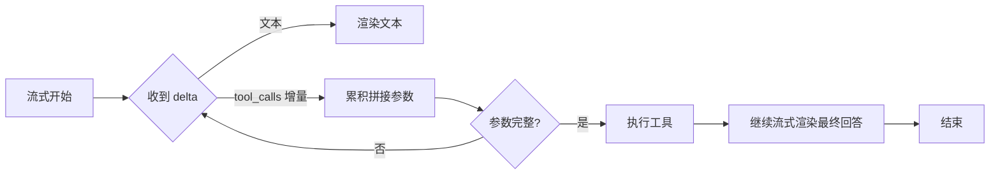

# 流式输出：让 Agent 开口就说话

> 「AI Agent 工程实践」系列 · 进阶篇第 2 篇。
> 面向前端开发者：流式是什么、怎么接、怎么展示。
> 相关：[大模型基础](./llm-basics.md) / [Function Calling](./function-calling.md)

## 为什么需要流式

- 非流式：等模型生成完整回答才返回——首字可能要几十秒，用户以为卡死了；
- 流式：token 一个接一个返回——首字毫秒级，体验好。

对 Agent 尤其重要：中间要调工具，非流式用户完全看不到进度，只能干等。

## 原理

服务端用 **SSE**（Server-Sent Events）或 WebSocket 推送增量，前端收到即渲染，形成"打字机"效果：

```text
data: {"delta": {"content": "北京"}}
data: {"delta": {"content": "今天"}}
data: {"delta": {"content": "25℃"}}
data: [DONE]
```

每次推送一个 chunk，含 `delta` 增量，前端逐个累加渲染。

## Agent 场景：流式 + 工具调用

工具调用参数也是**增量到达**的，不能拼一半就执行，要等 `tool_call` 完整：



前端展示策略：

1. **文本流**：直接渲染；
2. **思考中**：显示"正在思考…"（若推理可见，可流式展示 Thought）；
3. **工具调用卡片**：检测到 `tool_calls` → 显示"正在查询天气…"（工具名 + 参数）；
4. **结果回填后**：继续流式渲染最终回答。

## 前端渲染注意

- **性能**：增量渲染要批处理/防抖，别每个 token 都触发一次重渲染；
- **状态机**：`idle → streaming_text → tool_calling → streaming_text → done`，任何一步都能中断；
- **中断与报错**：用户停止生成要能取消请求；连接断开要能重连或提示；
- **计费不变**：流式只影响体验，不影响最终 token 消耗。

## 注意（坑）

1. **SSE 解析要严谨**：按行切分、去 `data:` 前缀、处理 `[DONE]`，别把事件头当内容；
2. **tool_calls 增量要拼完再执行**：参数是分片到达的，`JSON.parse` 要等完整；
3. **并发/重试防重复渲染**：重连后可能收到重复 chunk，要做去重；
4. **移动端断线重连**：网络不稳定时，重连与续传逻辑要稳。

## 总结

流式是"体验工程"：首字快、过程可见、工具调用有卡片。对 Agent 产品，它是标配不是加分项。下一篇讲多轮对话的成本与窗口问题——[多轮记忆压缩](./memory-compression.md)。
