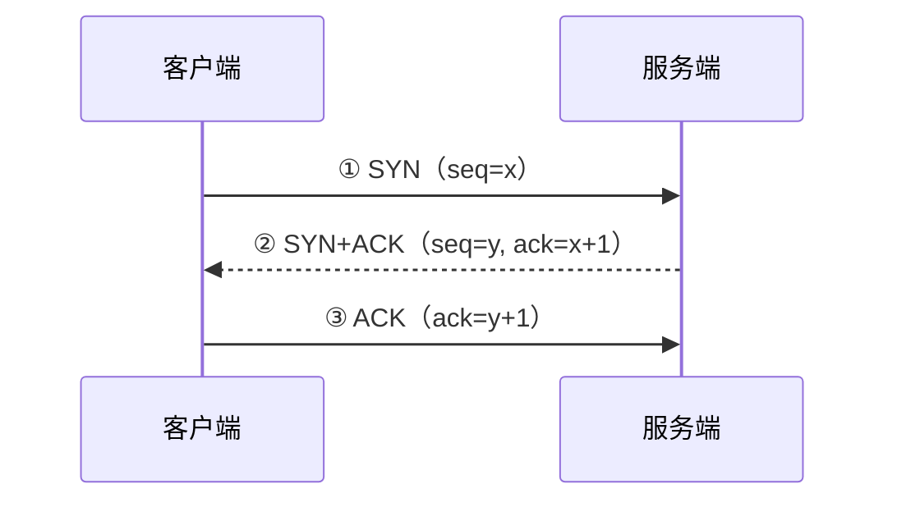
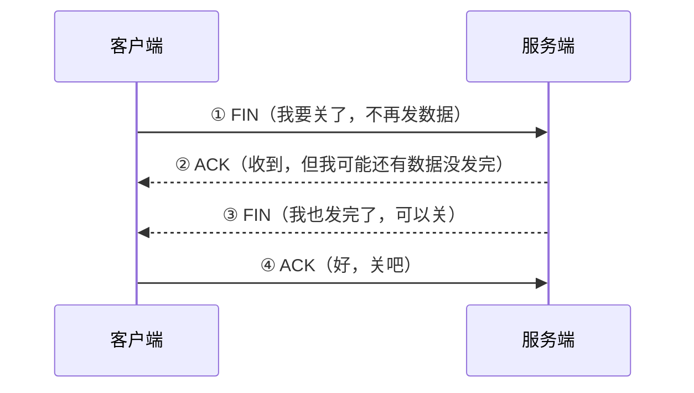

# TCP 三次握手与四次挥手

> 「网络知识」系列第 2 篇。
> 相关：[HTTP 协议](./http2.md) / [HTTPS 与 TLS](./https.md)

## 先搞清楚位置

HTTP 跑在 TCP 之上。浏览器发一个请求，底层先要建立一条可靠的 TCP 连接——这个"建连"过程就是**三次握手**，关连接就是**四次挥手**。

## 三次握手：建立连接

三个动作各干什么：

1. 客户端发 `SYN`：**我想连你**，带上初始序号 x；
2. 服务端回 `SYN+ACK`：**可以，我也要连你**，确认你的序号（x+1），带上自己的初始序号 y；
3. 客户端回 `ACK`：**收到，连接建立**，确认服务端的序号（y+1）。

### 为什么不是两次握手

假设只有两次：客户端发的 SYN 在网络里卡住超时重发，旧的 SYN 又先到服务端——服务端以为要建连，**白白分配资源**，而客户端根本不认这条连接。

三次握手让服务端能确认"客户端确实收到了我的 SYN+ACK"，不会为失效的连接浪费时间。

### 为什么不是四次

理论上可以，但没必要：SYN 和 ACK 可以**合并成一条**（SYN+ACK），省一次往返。

## 四次挥手：关闭连接

### 为什么是四次而不是三次

因为 TCP 是**全双工**：两个方向各管各的。客户端说"我不发了"（FIN），服务端还得先把自己剩下的数据发完，再回自己的 FIN。所以中间那两步（ACK 和 FIN）**不能合并**，必须分开。

### 挥手的坑：TIME_WAIT

第 ④ 步客户端发完 ACK 后，不会立刻消失，而是进入 `TIME_WAIT` 状态等 2MSL（最大报文段生存期×2，通常约 2 分钟）。

为什么等：万一最后的 ACK 丢了，服务端会重发 FIN，客户端得能再回一次 ACK；同时让这条连接上的旧报文在网络里彻底消失，避免污染新连接。

代价是：**大量短连接**的场景（比如高并发 HTTP 请求），会积压一堆 TIME_WAIT 连接占着端口。这也是 HTTP/1.1 引入"持久连接"的原因之一——复用连接，少挥手。

## 主要状态一览

| 状态 | 属于谁 | 含义 |
| --- | --- | --- |
| LISTEN | 服务端 | 监听端口 |
| SYN_SENT | 客户端 | 发了 SYN 等确认 |
| SYN_RCVD | 服务端 | 收到 SYN 回了 SYN+ACK |
| ESTABLISHED | 双方 | 连接建立，正常传数据 |
| FIN_WAIT_1 / 2 | 主动关闭方 | 发了 FIN / 收到对方 ACK |
| CLOSE_WAIT | 被动关闭方 | 收到对方 FIN，等待自己发 FIN |
| TIME_WAIT | 主动关闭方 | 等 2MSL 后彻底关闭 |
| CLOSED | 双方 | 关闭 |

## 注意（坑）

1. **SYN flood 攻击**：攻击者狂发 SYN 不回 ACK，服务端 SYN_RCVD 队列被占满，正常用户连不上。缓解手段：SYN Cookie、限制半连接队列；
2. **CLOSE_WAIT 堆积**：服务端收到 FIN 后一直不回 FIN（通常是代码没关闭 socket），大量 CLOSE_WAIT 说明有连接泄漏，查代码；
3. **seq/ack 都要 +1**：确认号是"期望收到的下一个序号"，所以 ack = 对方 seq + 1，别记反；
4. **握手挥手是"标准剧本"**：异常路径（丢包重传、超时）是常见面试追问点，本质都是"没收到确认就重发"。

## 总结

三次握手**确认双方收发能力都正常**（防失效连接），四次挥手**因为全双工要分别关两个方向**（所以多一次）。TIME_WAIT 是安全性代价，也是 HTTP/1.1 持久连接存在的理由之一。

下一篇：[HTTPS 与 TLS](./https.md)——HTTP 是明文裸奔，加密握手怎么补上这一课。
